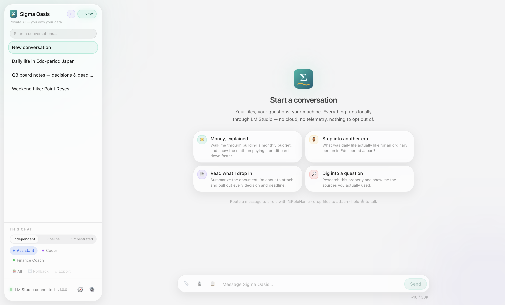
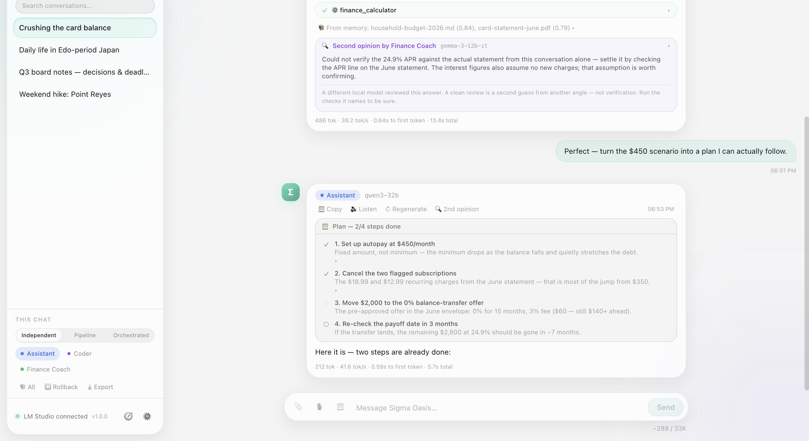
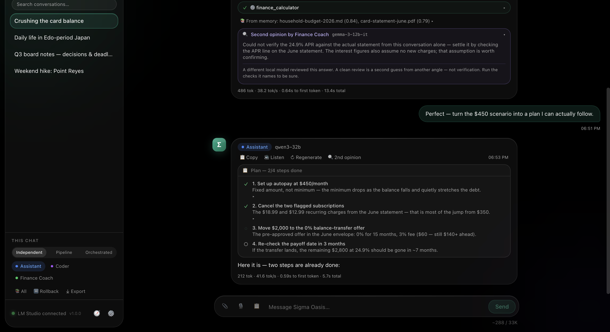

# 🧠 Sigma Oasis

**A private, local-first desktop AI chat app powered by [LM Studio](https://lmstudio.ai).**

Sigma Oasis is a cross-platform (macOS + Windows + Linux) desktop application, inspired by the
Claude Desktop UI, that talks to models running locally in LM Studio via its OpenAI-compatible
API. It supports **up to 3 model "roles"** simultaneously, **agentic tools** (file I/O, terminal,
web search, notes), **@mention routing**, and a **collaborative pipeline** mode, all while keeping
**every byte of data on your machine**. No cloud, no telemetry.



| Light theme | Dark theme |
| --- | --- |
|  |  |

---

## ✨ Features

- **Local & private.** Connects only to your LM Studio server (`http://127.0.0.1:1234/v1` by default). The only other outbound paths are the privacy-preserving `web_search` / `image_search` / `fetch_webpage` tools (provider of your choice), the image hosts an `image_search` result points at (thumbnails only, fetched by the app so the request carries no cookies, referrer or browser fingerprint), the shopping research tools (`shop_compare` / `price_watch`, which contact retailer and manufacturer pages), the opt-in JavaScript page renderer (which contacts a page's own origin and nothing else), and update checks (opt-in, off by default). All of it is enforced by a built-in egress allowlist, visible in a network activity log with a purpose on every row, and can optionally be routed through **Tor or a VPN** while your LM Studio server stays on a direct loopback connection.
- **Multi-model roles (up to 3).** Each slot has its own model, role name, system prompt, and color accent.
- **Three ways to use your models**
  - **Independent mode.** Pick the active model in the sidebar's *This chat* section; each conversation keeps its thread.
  - **@mention routing.** Type `@Coder write a sort function` to route a single message to a specific role.
  - **Collaborative pipeline.** Your message flows through an ordered chain of models, each building on the previous one's output.
  - **Orchestrated mode.** An orchestrator model reasons about your request and **delegates to the other roles as tools** (`consult_model`), reads their answers, consults again if needed, then synthesizes the final reply. Specialists run with their own persona, tools, and memory; delegation loops are structurally impossible and consultations are capped per turn. Every delegation appears as an expandable "🤝 Consulted …" block.
- **Reasoning models are first-class.** Qwen3, the DeepSeek-R1 distills, gpt-oss, Magistral and friends emit their chain-of-thought inline. Sigma Oasis separates it from the answer as the tokens arrive, so thinking appears as a collapsed **"💭 Thought for 12s"** block instead of unlabeled prose, is never read aloud by voice mode, and is not replayed back to the model on the next turn. Gemma 4's native control tokens (`<|think|>`, `<|channel>thought`) are handled too, and when a server passes Gemma 4's native tool-call markup through as text instead of executing it, Sigma Oasis parses the call out and runs it through the normal tool loop.
- **File, image & PDF attachments.** Drag & drop or use the 📎 button. Images are sent to vision-capable models (multimodal `image_url` parts); text files and **PDFs** are extracted and inlined into context; a document longer than 20 K characters keeps its opening inline and is indexed in RAM, and every question retrieves the passages of it most relevant to that question (shown under the reply as "From the attached document(s)") — nothing is written to disk, and nothing leaves the machine. An encrypted PDF, a scan with no text layer, or an encoding that cannot be decoded is refused by name rather than handed to a model as garbled text.
- **Per-role sampling, with an honest performance readout.** Each slot has its own temperature, top-p, max tokens and seed; set temperature to 0 with a fixed seed and a role becomes reproducible. Under each reply: tokens/sec and time to first token. Token counts come from LM Studio's own accounting; when a server does not report them, only timing is shown rather than an estimate dressed up as a measurement.
- **Knows what your models can do.** Model discovery reads LM Studio's REST API, so the picker shows quantization, context length and whether a model is currently loaded, and the composer warns before you send an image to a model LM Studio reports as text-only.
- **Conversations that don't forget their beginning.** History is budgeted against the context window the model is actually loaded with, not a fixed character count. When a conversation outgrows it, the overflow is **summarized and carried forward** rather than silently deleted, and a context meter beneath the composer shows how full the window is. Switch to plain trimming under Settings → General.
- **Voice chat, fully local.** 🔊 Any reply can be read aloud with your OS's on-device voices, and an optional **voice mode** auto-reads replies. Push-to-talk 🎙️ records your voice and transcribes it **locally with [whisper.cpp](https://github.com/ggerganov/whisper.cpp)** plus a ggml model: `brew install whisper-cpp` on macOS/Linux, or `whisper-cli.exe` from the whisper.cpp releases on Windows. Both are auto-detected; override the paths under Settings → Voice. No audio ever leaves your machine.
- **Long-term local memory (RAG).** A built-in vector store embedded via LM Studio's `/v1/embeddings`. Relevant memories are **automatically recalled into every conversation**; models can save/search/forget memories with dedicated tools; notes are auto-indexed; and you can add documents under **Settings → Memory**. Everything stays on disk as local JSON. Vectors are tied to the model that produced them, so if you switch embedding models, **Settings → Memory** flags the sources that need re-indexing rather than returning meaningless matches. New in 0.9: recall is **visible** (each reply shows which memory chunks it used) and **scoped** (a conversation can restrict which sources it recalls from).
- **Offline reference library — the Almanac (1.5).** Install curated **reference packs** (first aid, health, emergency preparedness, food safety, personal finance & tax, home safety, US civic basics — public-domain / OGL sources, 105 documents in `packs/`) or turn a folder of your own manuals and notes into a pack. Passages are retrieved by relevance (keyword + semantic) with a citation — *pack › document › section*, plus source, license and date — and the app consults the library **before the model answers** first-aid, health, finance, legal, home-repair and food questions, and any factual question while offline. Shown under the reply as **📖 From the library**. Entirely local: nothing about it uses the network.
- **Playbooks (1.5).** One short numbered method per turn for the kind of question — first aid, health, structural/electrical, preparedness, food safety, home repair, finance & tax, legal, data analysis, code, comparison, plans — so a small model acts like it has procedure it does not have. Disclosed under the reply (**📋 Method: …**); off switch on the Models tab.
- **Second opinions (0.9).** A "🔍 2nd opinion" action under any reply has a **different role** review it and name the factual claims it could not verify, plus the check that would settle each. Never a confidence score — a model grading its own answer says "yes" nearly always.
- **Tool grounding (1.3).** After every reply the app checks, mechanically, whether the money figures and links in it actually came from the tools that ran. A payment the calculator did not return, a price on a shopping turn with no price check, a product URL in no search result — each gets a warning under the answer naming what was checked against what. No model call and no network: it is number and string comparison, so it holds even when the prompt telling the model not to invent things does not. Prompts are how you ask; this is how you know.
- **Plan mode (0.9).** The 📋 toggle in the composer turns a task into a visible step-by-step plan: decomposed by the model, shown for your **approval**, executed step by step with live progress, then synthesized into a final answer. A failed step is marked failed and disclosed, never silently retried.
- **Ephemeral chats (0.9).** The ◌ button starts a conversation that lives only in RAM: never written to disk, gone when you close it or quit. The main process refuses to persist it — the no-trace guarantee is structural, not a habit of the UI.
- **Context rollback (0.9).** One click forgets what the model remembers that you can't see — the compacted summary and any fetched pages held in memory — while visible messages, notes and long-term memory stay untouched.
- **Session audit log (0.9, opt-in).** An append-only transcript of what was actually said (inputs, answers, tool calls — no hidden layers), encrypted with your OS keychain and hash-chained so tampering is detectable. Off by default; ephemeral chats are never logged.
- **Agentic tools** via OpenAI tool-calling: file read/write, directory listing, terminal (with a confirmation dialog), web search, date/time, and a local notes store.
- **Polished chat UI.** Streaming tokens, markdown rendering, syntax-highlighted code blocks with a Copy button, collapsible tool-call blocks, and per-message role badges.
- **Local persistence.** Settings via `electron-store`; conversations and notes as JSON in your OS app-data directory.
- **Light and dark themes** — light is the default since 1.0 — with adjustable font size and configurable history limit.

---

## 📥 Install

**macOS (Homebrew — easiest):**

```bash
brew tap CELCPG/tap
brew trust celcpg/tap   # Homebrew 6+ asks once before running third-party casks
brew install --cask sigma-oasis
```

Signed and notarized for both Apple Silicon and Intel; the app updates itself from then on.

**Direct download:** grab the installer for your platform from
[Releases](https://github.com/CELCPG/SigmaOasis/releases) — macOS `.dmg` (arm64 + x64), Windows `.exe`
installer (unsigned, so expect a SmartScreen prompt: *More info → Run anyway*), or Linux `.AppImage`.

---

## 📦 Prerequisites

1. **[LM Studio](https://lmstudio.ai)**: download, install, and:
   - Open the **Developer / Local Server** tab.
   - Load at least one model (e.g. a Llama / Qwen / Mistral GGUF).
   - Click **Start Server** (default port `1234`). LM Studio then exposes an OpenAI-compatible API at `http://127.0.0.1:1234/v1`.
2. **[Node.js](https://nodejs.org) 18+** and npm (only needed to run/build from source).

---

## 🚀 Run in development

```bash
npm install
npm run dev
```

This starts the Vite dev server (with hot reload for the React renderer) and launches the Electron app.

---

## 🏗️ Build for distribution

```bash
# Build for your current OS
npm run build

# Or target a specific platform
npm run build:mac    # → dist/*.dmg
npm run build:win    # → dist/*-setup.exe (NSIS installer)
```

Packaged installers are written to the `dist/` folder:
- **macOS** → `.dmg`, built for both `arm64` and `x64` (`npm run install:mac` builds only this Mac's architecture)
- **Windows** → `.exe` (NSIS installer)
- **Linux** → `.AppImage`

> To create a quick unpacked build for testing without an installer: `npm run build:unpack`.

---

## ⚙️ Configuring models

Open **Settings** (gear icon, bottom-left) → **Models**. For each of the 3 slots:

1. **Enable** the slot with the checkbox.
2. Choose a **Model** from the dropdown. Each entry shows what LM Studio reports about it:
   quantization, context length, whether it takes images, and whether it is currently loaded.
3. Give it a **Role name** (e.g. `Assistant`, `Researcher`, `Coder`). This becomes its badge and its @mention handle.
4. Write a **System prompt** describing the model's persona/instructions.
5. Pick a **color accent** (blue / purple / green).
6. Open **Sampling** for per-role **temperature**, **top-p**, **max tokens** and **seed**.
   Temperature `0` with a fixed seed makes a role reproducible: the same prompt returns the same
   answer, which is what you want for a Coder slot and not what you want for a brainstorming one.
   Max tokens `-1` leaves the reply length to LM Studio.

Under **Settings → Connection** you can change the LM Studio base URL and test the connection.

> The capability details come from LM Studio's own REST API. On an older LM Studio without it, the
> dropdown falls back to plain model ids and the app behaves as it did before; it does not guess.
> Note that LM Studio reports **no tool-use capability flag**, so there is deliberately no badge
> claiming a model can call tools: a wrong badge would be worse than none.

---

## 💬 Using @mention model switching

In any conversation, prefix or embed a mention of a role name (spaces removed, case-insensitive):

```
@Coder refactor this function to be O(n)
@Researcher what are the tradeoffs of gRPC vs REST?
```

The message is routed to that model regardless of the current mode. The reply shows the routed model's role badge.

---

## 🔗 Using Collaborative Pipeline mode

1. In **Settings → Pipeline**, tick the models you want to participate and reorder them with the ◀ ▶ buttons.
2. In a conversation, switch the top-bar toggle from **Independent** to **Collaborative**.
3. Send a message. It goes to the **first** model; that model's output is forwarded as context to the **second**, and so on. Each model posts its own reply with its role badge, so you can watch the chain build up.

Example pipeline: `Researcher → Coder → Assistant`. Research the problem, write the code, then summarize.

---

## 🛠️ Agentic tools

Tools use LM Studio's OpenAI-compatible **tool calling**. When a model requests a tool, Sigma Oasis
executes it **in the Electron main process** (never the renderer) and feeds the result back to the
model. Each call appears as a collapsible **"Tool Used: …"** block showing the arguments and result.

| Tool | Description |
| --- | --- |
| `read_file` | Read the contents of a local file. |
| `write_file` | Write/overwrite a local file. **Off by default**; confirms each write when no working directory is set. |
| `list_directory` | List entries in a directory. |
| `run_terminal_command` | Run a shell command. **Off by default**; shows a confirmation dialog before every run, with destructive patterns (e.g. `rm -rf`, `dd`, `curl \| sh`) flagged as dangerous. |
| `web_search` | Web search via your chosen privacy-preserving provider: self-hosted **SearXNG**, **Brave Search API**, or **DuckDuckGo** (Settings → Search). Queries are sanitized (emails, tokens, paths, etc. redacted) before they leave the machine. |
| `image_search` | Find pictures and show them as thumbnails in the chat, each linked to its source page. Same provider and same query sanitization as `web_search`. Thumbnails are fetched **by the main process** — through the SSRF guard, your proxy and the activity log, with no cookies, referrer or browser fingerprint — then downscaled and inlined as `data:` URLs, so the chat window itself makes no network request. Capped at 6 images per search; those hosts still see your IP unless a proxy is on, and the confirmation dialog says so. |
| `fetch_webpage` | Fetch and read a public web page or **PDF** (HTTPS only, scripts/ads/site chrome stripped). Private/internal addresses are refused (SSRF guard). Pass a `query` and the page is split into passages and **ranked**, so the model gets the parts that answer the query instead of the first few thousand characters. Outbound links are returned so a citation can be followed directly. Re-reading a page already fetched makes no new network request. |
| `deep_research` | Research a question across many sources in **one call**: plans sub-questions, searches, reads and ranks the best pages, checks what is still unanswered, and returns a brief with numbered citations. See below. |
| `get_current_datetime` | Return the current local date/time. |
| `create_note` | Save a note to the local notes store. |
| `list_notes` | List saved note titles. |
| `read_note` | Read a note by title. |
| `memory_save` / `memory_search` / `memory_forget` | Write to, search, and delete from long-term local memory. Stored on this machine; recalled chunks are shown in the reply so you can see what was injected. |
| `reference_lookup` | **1.5.** Search the offline reference library — installed packs and your own document folders — and return passages with citations and provenance. **On by default**; reads only this machine, never the network. Also run automatically by the app on reference-domain and offline turns. |
| `shop_requirements` | Turn a shopping ask ("a quiet air purifier for a 40 m² bedroom under $300") into a structured checklist the comparison is then scored against. |
| `shop_compare` | Price the same product across sellers side by side — through the proxy when you require it, with worst-privacy sellers excludable. Prices are extracted mechanically from the page, never written by the model. When enabled, the app runs this itself on a turn it detects as a purchase decision, so the model has real offers rather than remembered ones. |
| `price_watch` | Add, list, remove and re-check watched items. The watchlist is a file on this machine; no account, no tracker, nobody else holds the list. |

**Enable/disable tools** and set a **working directory** under **Settings → Tools**. Disabled tools
are not exposed to the models at all.

The **working directory** does two things: relative paths resolve against it, and it acts as a
**boundary**. `read_file`, `write_file`, and `list_directory` refuse any path that resolves outside
it. Leave it empty for unrestricted paths; every `write_file` call is then confirmed individually.

> ⚠️ **Security note:** `run_terminal_command` and the file tools operate on your real filesystem,
> and a model can be influenced by anything it reads: web search results, attached documents, files
> on disk. `write_file` and `run_terminal_command` ship **disabled**; the terminal tool always asks
> for confirmation. Set a scoped working directory before enabling write access.
> All text returned from the web (`web_search`, `image_search`, `fetch_webpage`) is fed back to models wrapped in an
> explicit **"untrusted external content"** marker, so the trust boundary is visible to both the
> model and you.

---

## 🧮 Context: budgeting and compaction

A conversation eventually outgrows what the model can hold. Through v0.8.1 the response was two
constants (40 messages, 48,000 characters) applied identically to a 4K model and a 128K one, and
whatever did not fit was deleted from the wire history with no summary and no signal. The model lost
the beginning of the conversation, and you found out when it contradicted itself.

Two changes:

- **The budget is the real window.** LM Studio reports `loaded_context_length`: what the model is
  *actually* loaded with, which is often far below what it supports. A 128K model loaded at 4K will
  accept a request it then truncates from the front, taking the system prompt with it. History is
  sized against that number, minus the system prompt, the tool schemas, a reply reservation and a
  safety margin.
- **The overflow is summarized, not deleted.** What no longer fits is compacted by your local model
  into a short note carried in the system prompt as *"Earlier in this conversation…"*. Each
  compaction folds the previous note in with the newly dropped messages, so it stays one bounded
  block however long the conversation runs.

A context meter beneath the composer shows how full the window is (`~12.4K / 32K`, amber near the
limit), and `· compacted` once a conversation has been summarized. **Settings → General** switches back to plain trimming.

Two honest caveats, both stated in the UI as well:

- **The token count is an estimate**, derived from text length rather than a real tokenizer. Matching
  the tokenizer would mean shipping the vocabulary of whatever model you happened to load; being
  wrong by ~15% inside a budget that already reserves headroom costs nothing.
- **Compaction is best effort.** No summarizer model, a timeout, an empty reply: any failure falls
  through to plain dropping. Losing the start of a conversation is bad; refusing to answer the
  message you just sent because the summarizer had a bad day is worse.

When LM Studio reports no context length at all, the pre-0.8.2 message/character rule applies
unchanged, so an older server behaves exactly as it did before.

---

## 🆕 v0.9: verification, privacy controls and plans

Six additions, all built on the same two rules the rest of the app follows: a model never grades
itself, and privacy promises are enforced in code rather than stated in prose.

### Second opinions — a different model, never a self-grade

A "🔍 2nd opinion" button under any reply hands the question and answer to **another role** (auto:
the first enabled slot that did not answer; choose one under Settings → Models). The reviewer lists
the specific factual claims it cannot verify from the conversation — names, dates, numbers,
versions — and the one check that would settle each. That is the whole output. There is deliberately
no confidence score or percentage: asking a model how sure it is returns "sure" nearly always, which
is the same reason deep research checks its coverage mechanically.

Two honest limits, stated in the UI as well: the reviewer is another local model with the same blind
spots (a clean review is a second guess from a different angle, not verification — run the checks it
names), and with only one role enabled the feature says no independent review is possible instead of
quietly asking the answerer to review itself.

### Plan mode — multi-step tasks with an approval gate

Toggle 📋 in the composer and your message becomes a plan instead of a direct answer. The model
decomposes the task into a short ordered checklist (structured JSON with grammar enforcement where
the server supports it, capped under Settings → General), the checklist renders in chat and — by
default — **waits for your approval** before anything runs. Each step then executes as a bounded
sub-turn with the enabled tools, its result feeding the next step and ticking off live in the list.
A final synthesis answers from all step results.

Failure behavior matches deep research: a planning failure falls back to answering directly and says
so; a failed step is marked ✗, halts the plan, and the synthesis states plainly what that leaves
unanswered. Nothing is retried silently, and every tool call a step makes goes through the same
confirmations and the audit log as any chat turn.

### Ephemeral chats — the no-trace conversation

The ◌ button next to "+ New" starts a chat that is never written to `conversations/`. It lives in
RAM, shows a banner saying exactly that, and is gone when you close it or quit. The guarantee is
structural: the main-process save handler refuses any conversation flagged ephemeral, so the
no-trace promise holds even if the renderer regresses. Two deliberate exceptions, both stated in the
banner: notes or memories you *explicitly* save are still saved (that was you choosing to keep
something), and the network activity log still records that a loopback model call happened (it logs
origins, never content).

### Context rollback — forget what you can't see

A conversation accumulates two kinds of invisible context: the compaction summary of messages that
scrolled off, and the RAM index of fetched web pages. Both can drift or go stale. "⏪ Rollback" in
the sidebar's *This chat* section drops exactly those two, after a confirmation that names them, and posts an in-chat
marker recording what happened. Visible messages are untouched; notes and `memory.json` are
untouched. The next turn rebuilds context from what you can actually see.

### Memory you can see and scope

Recall used to be invisible: chunks were injected into the system prompt and you could not tell a
memory-informed answer from a hallucinated one. Now every reply that used memory shows a
"📚 From memory: …" line listing the sources and relevance scores, expandable to the exact chunks.
The display is mechanical — the app shows what it actually injected, it does not ask the model to
footnote itself.

The 📚 picker in the sidebar's *This chat* section scopes a conversation to specific memory sources (or none): one chat
can know only the company handbook while another knows only personal notes, with neither bleeding
into the other. Unscoped conversations behave exactly as before.

### Session audit log — the verifiable transcript

Settings → Privacy can enable an append-only log of what was actually said: your inputs, the model's
answers, and each tool call with its arguments and outcome. No system prompts, no recalled memory,
no compaction notes — the layers you *can't* see stay out, so the log answers "what was said", not
"what the model was told". Every line is encrypted with your OS keychain (the log refuses to run
where that is unavailable — a plaintext audit trail is a worse privacy story than none) and carries
the hash of the line before it, so an edited or deleted entry breaks the chain and export says so.

Off by default, because a privacy app does not log by default. Ephemeral chats produce no entries —
no-trace includes the log. Optional auto-purge on quit keeps verification session-scoped.

---

## 📖 v1.5: the Almanac — an offline reference library and playbooks

A 9–30B model is thin on the long tail, weak at procedure, and — until now — had nothing to read
when the network was off except its own memory. v1.5 moves knowledge and method out of the weights
and into the app.

### Reference packs (Settings → Library)

- **Install a pack.** A pack is a folder: `manifest.json` (id, name, license, and for every document
  its title, source URL, license and date) plus `docs/*.md`. Seven curated packs are in the
  repository under [`packs/`](packs/): `first-aid` (NHS, OGL v3.0), `health` (MedlinePlus NLM
  summaries), `preparedness` (Ready.gov), `food-safety` (FoodSafety.gov / USDA / FDA), `finance`
  (CFPB / Investor.gov / IRS), `home-safety` (USFA / EPA), `civic` (USA.gov). *Install pack…* and
  choose the folder; the documents are **copied**, so the source can go away. Format and rebuild
  instructions: [`docs/library-pack-format.md`](docs/library-pack-format.md).
- **Add your own folder.** *Add folder…* snapshots `.md`, `.txt` and `.pdf` files (recursively) into
  a pack; each passage cites the original file path.
- **Keyword first, semantic when you ask.** A pack is searchable the moment it is installed (BM25).
  *Embed* computes vectors with the loaded embedding model for meaning-based matching; they are stored
  per model, so switching embedding models is noticed, not silently wrong. Retrieval is BM25 +
  cosine fused by reciprocal rank, MMR-deduplicated — the same machinery as fetched web pages.
- **Try a lookup** in the tab shows exactly what the model would be given.

### How the model reaches it

- `reference_lookup` — a tool the model can call (on by default; local only).
- **App-initiated:** on first-aid, health, finance, legal, preparedness, home-repair and food
  questions, and on *any* factual question while offline, the app queries the library before the
  model speaks and appends the passages to the turn with the standing rule: cite by bracket, quote
  steps and figures, say so if the passages do not answer. The reply shows **📖 From the library**
  and the lookup as a tool record. An empty library injects nothing.
- **Offline is a mode.** Offline, the grounding rules name the library instead of `web_search`, the
  automatic search is skipped, and the unverified badge says that no web source could be reached.

### Playbooks

Twelve short numbered methods (`src/renderer/src/lib/playbooks.ts`), one chosen per turn by the same
domain classifiers: first aid, health & medication, structural/electrical/gas, emergencies &
preparedness, food safety, home repair, personal finance & tax, legal & civic, data analysis, code,
comparing options, plans. Each is under 130 words, rides the turn's notes after any reference
passages, and is disclosed as **📋 Method: … playbook**. Settings → Models → Playbooks.

---

## 🔒 Privacy, search & network egress

Sigma Oasis's promise (*your data is never sold and never leaves your machine without your say-so*)
is enforced structurally, not just by policy:

- **Egress allowlist.** Every request the main process makes goes through an allowlist derived from
  your settings: your loopback LM Studio server, plus the one search provider you chose. Anything
  else is blocked before it is sent and recorded as blocked.
- **Network activity log.** Settings → **Privacy** shows every request (newest first): purpose,
  origin, status, time. Only origins are recorded, never full URLs, so your queries stay private
  even in the log. With search disabled, this list should show nothing but LM Studio.
- **Optional proxying.** Search, page reads and rendering can all be routed through a proxy you run
  (Tor, a VPN). It is the only control here that hides *who is asking*.
- **Update checks are opt-in.** The app can check GitHub Releases for updates, but only if you
  enable it (Settings → Privacy or General). Manual "Check now" always works.
- **Pages you read are never written to disk.** Web pages a model reads are chunked and embedded in
  RAM so only relevant passages are surfaced; the index is discarded on quit and never becomes part
  of your long-term memory unless you explicitly save it. Settings → **Privacy** shows how much is
  held and lets you forget it immediately.

### Deep reading: relevance instead of truncation

A long reference page has to be cut down before it fits in a model's context. Cutting it at the
first 8,000 characters (what v0.6 did) usually removes the part that answers the question and
burns the budget the next four sources needed.

Instead, a fetched page is split into passages, embedded locally through LM Studio's
`/v1/embeddings`, and ranked against what the model is actually looking for:

- **Hybrid ranking.** Semantic (embedding) and keyword (BM25) rankings are fused with Reciprocal
  Rank Fusion. Embeddings catch paraphrase and synonym; BM25 catches the exact tokens embeddings are
  weak on (version numbers, error codes, API names). Neither is trusted alone.
- **Works with no embedding model.** If LM Studio has none loaded, retrieval degrades to keyword-only
  and says so, rather than failing.
- **Near-duplicates removed.** Overlapping passages are pruned (MMR) so the results aren't five
  windows onto the same paragraph, and survivors are shown in page order with a position and score.
- **Local only.** Chunking, embedding and ranking all happen on your machine; the page text is the
  only thing that ever crossed the network, and it already did.

Alongside ranking, reading a source now handles the things that used to make deep research
impractical:

- **Site chrome is removed properly.** Menus, cookie banners and "related stories" rails are stripped
  by class and id, not just by tag, and the article container is picked by text density. When no
  distinct article can be identified, the model is told so rather than left to guess.
- **PDFs are read.** Papers, filings and standards are extracted directly (including the ToUnicode
  font maps modern PDF producers use). If a PDF is encrypted, is a scan with no text layer, or uses an
  encoding that cannot be decoded, Sigma Oasis says exactly that instead of returning garbled text.
  A model cannot tell mojibake from content, so guessing is worse than refusing.
- **Links come back.** An agent that reads a page can follow a citation directly instead of going
  back to the search provider, which saves both a round-trip and another query on the wire.
- **Repeated searches are served locally.** Identical queries within ten minutes are answered from
  RAM, so the provider sees one query instead of five. This also keeps bursts inside the rate limits
  DuckDuckGo and Brave's free tier enforce.

### Routing traffic through Tor or a VPN (Settings → Privacy)

Everything else here limits *what* is disclosed: which provider sees a query, what the query says,
how many domains get contacted. None of it hides *who is asking*. Pointing Sigma Oasis at a proxy you
run does:

| Setting | Effect |
| --- | --- |
| **SOCKS5** (recommended) | Hostnames are resolved **at the proxy**, so your local resolver never learns which sites you read. Tor's daemon listens on `9050`; the Tor Browser bundle uses `9150`. |
| **HTTP proxy** | Works, but DNS behavior depends on the proxy. Prefer SOCKS5 where you have the choice. |
| **No proxy** (default) | Direct connections. |

Two things worth knowing:

- **Your LM Studio server is never proxied.** It is pinned to a direct connection explicitly, not
  merely left unconfigured. Routing model traffic through Tor would be slow, pointless (it is
  loopback) and would break the app whenever the proxy went down.
- **"Test proxy" exists because a misconfigured proxy fails silently** by simply not being used,
  while you believe you are covered. The test reports the IP address sites actually see. It is also the
  one time the app contacts a third party on its own behalf (`api.ipify.org`), which is why it is on
  the egress allowlist by name and only ever runs when you press the button.

Under the hood this needed more than a settings field. All outbound traffic goes through
**Electron's network stack** rather than Node's `fetch`: undici does not consult Electron sessions, so
a proxy set there would have covered only the page renderer and left `web_search` and `fetch_webpage`
going out directly. That would be a privacy feature that silently misses the paths that matter most.

### Deep research: many sources, one tool call

`web_search` and `fetch_webpage` are enough for a quick lookup. For a real question, chaining them by
hand runs into two walls: the agentic loop stops after 8 consecutive tool rounds, and every page a
model reads stays in the conversation. A search plus a fetch costs two rounds, so an improvising model
gets about **four sources per turn**, and the pages it read have already crowded out the room it needed
to reason about them.

`deep_research` moves the whole crawl into the main process, inside a single tool call:

```
plan → search → select → read → reflect → (one more round) → synthesize
```

Twenty pages can be searched, fetched, ranked and discarded without any of it touching the
conversation. Only the synthesized brief and its citations come back. The orchestration is code, not
model improvisation, so it is bounded and repeatable rather than a matter of how well the model
happened to plan.

- **Planned, then checked.** A local model decomposes the question into sub-questions and keyword
  queries. After reading, coverage is assessed **mechanically** (enough high-scoring text per
  sub-question) and a second round targets only what is still open. Asking a model to grade its own
  work would return "yes" nearly always, and the second round would never happen.
- **Every phase has a budget.** Rounds, searches, pages, distinct domains and wall clock, chosen by
  **Settings → Search → Deep research budget** (quick / standard / thorough). Limits are checked before
  each action, not reported after, and any limit that stopped the run is disclosed in the result.
- **Sources are ranked before they are fetched.** Snippets are scored against the sub-questions first,
  so a page that will not help is a host never contacted. A per-domain cap keeps one prolific site from
  filling the evidence base.
- **The brief is cited or it says so.** Every claim carries a `[n]` pointing at a real URL, and
  sub-questions the sources did not answer are listed as gaps rather than filled in from the model's
  own knowledge.

#### What leaves your machine

Your question does not. Only the planner's keyword queries go out, each through the same redaction as
any other search. Turn on **Settings → Search → Approve research plans** and you get one dialog showing
every sub-question and every outgoing query before anything is sent. It is more informative than six
separate prompts, and it is the moment to catch a query carrying context it should not. The result
reports every domain contacted, the number of searches and pages, and any redactions applied.

### JavaScript-dependent pages (opt-in)

Documentation sites and single-page apps return an empty shell to a plain HTTP fetch; their content
arrives only once scripts run. Enable **Settings → Search → Read JavaScript-dependent pages** and
Sigma Oasis will re-read such a page in an offscreen browser window.

It is **off by default**, and static-first when on: the plain fetch is always tried first, and the
browser is used only when that comes back empty or the page is recognizably an app shell. A plain
fetch executes nothing and contacts exactly one host, so it stays the preferred path.

A browser normally reaches the network on its own, outside any allowlist. That is not acceptable here,
so every request the render session makes passes through a single filter that:

- **blocks every third-party request.** Only the page's own origin is allowed, which makes ad,
  analytics and tracker domains structurally unreachable. This is stricter than a normal browser, not
  a relaxation;
- **blocks anything that cannot carry text**: images, media, fonts, websockets, beacons;
- **records every request, allowed or blocked**, in the same network activity log as everything else,
  under the `render` purpose. The count of blocked origins is reported back with the page.

The session itself is ephemeral and per-page: no cookies, no cache, no storage, a fresh partition each
time and destroyed afterwards. No preload script is attached, so nothing in a fetched page can reach
`window.api`. All permission requests are denied, navigation away from the target is blocked, and load
time and extracted size are capped.

**Rendering also makes prompt injection harder, not easier.** With a real DOM, `getComputedStyle`
reveals text that is invisible to a human reader (`display:none`, `opacity:0`, zero font size,
screen-reader clipping, positioned off-canvas), which is exactly where injected instructions hide,
because a person reviewing the page never sees them. That text is dropped before the model sees it and
the amount removed is reported. The static regex path cannot do this at all, since the styling may
live in an external stylesheet.

### Choosing a search provider (Settings → Search)

| Provider | Privacy profile | Setup |
| --- | --- | --- |
| **Self-hosted SearXNG** (recommended) | Best: metasearch over 70+ engines from a server **you** run; only infrastructure you control ever sees queries. | `docker run -p 8888:8080 searxng/searxng`, enable JSON output (`formats: [html, json]`), set the URL in Settings → Search. |
| **Brave Search API** | Strong: independent index, no user profiling. | Free API key from brave.com/search/api; stored via your OS keychain (Electron `safeStorage`), never in the plaintext settings file. |
| **DuckDuckGo** | Good: no key, no tracking; rate-limited. | Works out of the box (default). |

Also configurable per your taste: results per search (1-10) and **Confirm every query**, which shows
the exact sanitized query for approval before each search is sent. Use the **Test connection**
button to verify your provider setup.

---

## 🗂️ Where data is stored

All data lives in your OS application-data directory (`app.getPath('userData')`):

- **Settings**: `config.json` (managed by `electron-store`)
- **Conversations**: `conversations/<id>.json`
- **Notes**: `notes.json`
- **Reference library (1.5)**: `library/<packId>/` — the pack's manifest, its copied documents, and `index.json` (embedding vectors, per model)

Typical locations:
- macOS: `~/Library/Application Support/Sigma Oasis`
- Windows: `%APPDATA%\Sigma Oasis`
- Linux: `~/.config/Sigma Oasis`

There is **no cloud sync and no telemetry**.

---

## 🧱 Project structure

```
sigma-oasis/
├── src/
│   ├── main/                 # Electron main process
│   │   ├── index.ts          # App/window bootstrap
│   │   └── ipc/
│   │       ├── tools.ts      # Agentic tool implementations + schemas
│   │       ├── store.ts      # electron-store, conversations, notes, encrypted secrets
│   │       ├── net.ts        # Egress allowlist + network activity log
│   │       ├── httpClient.ts # fetch-shaped transport over Electron's net stack
│   │       ├── proxy.ts      # SOCKS5/HTTP proxy config + egress vs local sessions
│   │       ├── search.ts     # Search providers + SSRF-guarded webpage fetch
│   │       ├── extract.ts    # HTML → main content, text and outbound links
│   │       ├── render.ts     # Offscreen renderer + third-party egress filter
│   │       ├── pageScript.ts # DOM extraction injected into an isolated world
│   │       ├── userAgent.ts  # The one shared, non-identifying User-Agent
│   │       ├── pdf.ts        # PDF text extraction (zlib only, no dependencies)
│   │       ├── embeddings.ts # Chunking + local embedding via LM Studio (shared)
│   │       ├── retrieval.ts  # BM25, rank fusion, MMR: pure ranking primitives
│   │       ├── researchIndex.ts # Ephemeral RAM index over fetched pages
│   │       ├── deepResearch.ts  # Plan → search → read → reflect → synthesize
│   │       ├── llm.ts        # Main-process model calls + tolerant JSON parsing
│   │       ├── modelPin.ts   # Keeps the chat model resident in LM Studio
│   │       ├── modelCatalog.ts # Model list + capabilities (context, vision, loaded)
│   │       ├── summarize.ts  # Rolling compaction of history that no longer fits
│   │       ├── attachments.ts # Images, text files and PDFs from disk
│   │       ├── audit.ts      # Opt-in encrypted, hash-chained session transcript (v0.9)
│   │       ├── plan.ts       # Plan mode: structured task decomposition (v0.9)
│   │       └── memory.ts     # Durable long-term memory (RAG) on disk
│   ├── preload/
│   │   ├── index.ts          # Secure context bridge (window.api)
│   │   └── index.d.ts        # Renderer-side typings
│   └── renderer/             # React + TypeScript UI
│       ├── index.html
│       └── src/
│           ├── main.tsx
│           ├── App.tsx
│           ├── types.ts
│           ├── assets/index.css
│           ├── lib/          # markdown, colors, ripple, reasoning split, context budget
│           ├── stores/appStore.ts        # Zustand global state
│           ├── hooks/
│           │   ├── useLMStudio.ts         # streaming + tool loop + routing
│           │   ├── useModels.ts           # model discovery / status
│           │   └── useConversations.ts    # persistence
│           └── components/
│               ├── Sidebar.tsx
│               ├── ChatArea.tsx
│               ├── MessageBubble.tsx
│               ├── InputBar.tsx
│               ├── EmptyState.tsx          # Starter cards before the first message
│               ├── SessionControls.tsx     # "This chat": mode, roles, memory scope, rollback, export
│               ├── ToolCallBlock.tsx
│               ├── ReasoningBlock.tsx
│               ├── SecondOpinionBlock.tsx  # v0.9 critic-pass review
│               ├── PlanBlock.tsx           # v0.9 plan checklist + approval gate
│               ├── SettingsModal.tsx
│               └── CollaborativeMode.tsx
├── test/                     # node:test suite (see Tests below)
│   ├── harness.ts            # Stubs the electron/net/store seams
│   ├── renderCheck.ts        # Browser checks in a real offscreen window
│   ├── httpClientCheck.ts    # Transport checks against a local HTTP server
│   └── fixtures/
├── scripts/test.sh
├── scripts/test-render.sh
├── electron.vite.config.ts
├── electron-builder.yml
├── tailwind.config.js
├── package.json
└── README.md
```

---

## 🧪 Tests

```bash
npm test
```

The suite covers the search, extraction, retrieval, PDF, attachment, model-catalog, reasoning-split,
context-budget and model-pinning code paths: the parts that are pure logic and easy to regress. It
uses Node's built-in `node:test` runner and **adds no dependencies**; if `node` is not on your PATH
it falls back to the Node runtime already bundled inside the project's Electron.

Two of these earn their place by being *silent* when they break: nothing throws, the answer is just
quietly wrong. The reasoning splitter is tested one character per delta, because a `<think>` tag
straddling two SSE chunks would otherwise leak into the answer; and it is tested with a `<think>` in
a mid-reply code block, because treating that as a real thought block would swallow the rest of a
legitimate answer. The context budget is tested for the newest message always surviving and for the
no-catalog fallback matching pre-0.8.2 behavior exactly.

Tests run against the real main-process modules, with only three seams stubbed (`electron`, the
network layer, and settings), so what is verified is the code that ships rather than a
re-implementation of it. The embedding stub is deterministic and folds a few synonyms onto shared
dimensions, which is what makes it possible to assert that semantic retrieval finds a passage keyword
retrieval provably cannot.

The run finishes with a second pass that needs Electron proper (`scripts/test-render.sh`), covering the
two things the node suite structurally cannot:

- **Page extraction in a real offscreen window.** Its whole job depends on `getComputedStyle` and a
  real layout, so mocking a DOM would only test the mock. A fixture is served over loopback and nine
  different ways of hiding text from a human reader are all asserted to be stripped before a model can
  see them.
- **The network transport**, against a local HTTP server. The node suite stubs the network layer, so
  nothing there exercises the transport every outbound request actually uses: status and header
  handling, manual vs followed redirects, byte caps, timeouts and cancellation.

Both skip themselves, rather than failing, where no display is available.

---

## 🧑‍💻 Tech stack

- **Electron** (desktop shell) + **electron-vite** (bundler/dev server) + **electron-builder** (packaging)
- **React 18 + TypeScript** (renderer)
- **Zustand** (state), **Tailwind CSS** (styling)
- **marked** + **highlight.js** (markdown & code highlighting)
- **electron-store** (settings persistence)

---

## 🩺 Troubleshooting

- **macOS Gatekeeper blocks the app.** Release builds are signed with a Developer ID certificate and
  notarized by Apple, so current releases open normally. If you built the app yourself without
  signing credentials, Gatekeeper will hard-block it. Fix: open **System Settings → Privacy &
  Security**, scroll to the Security section, and click **Open Anyway** next to the blocked-app
  notice. If the app was moved to Trash, drag it back to `/Applications` first. On macOS 26+, the old
  `xattr -dr com.apple.quarantine` workaround no longer bypasses this block.
- **"LM Studio not detected".** Make sure LM Studio's local server is **started** and a model is
  **loaded**. Click the **Retry** button or **Settings → Connection → Test / Refresh**.
- **A model slot says "No model selected".** Open **Settings → Models** and choose a model from the
  dropdown for that slot.
- **Different port/URL.** Update the base URL in **Settings → Connection** (e.g.
  `http://127.0.0.1:1234/v1`). The server must be on **this machine**: the renderer's
  Content-Security-Policy only permits loopback connections, so a LAN or remote LM Studio won't work
  for chat.
- **Tool didn't run.** Confirm it's enabled in **Settings → Tools**, and that the loaded model
  supports tool/function calling.
- **LM Studio keeps unloading the chat model between steps.** Sigma Oasis pins your chat model the
  first time it is used, which exempts it from LM Studio's auto-evict. The pin can only apply before
  the model is loaded some other way; if you still see eject/reload cycles (for example when LM
  Studio auto-loads a model at startup), open LM Studio → Developer → Server Settings and turn off
  **"Only Keep Last JIT Loaded Model"** (auto-evict), or load both your chat model and your embedding
  model manually in the server tab. Manually loaded models are never auto-evicted.

---

## 📄 License

MIT
